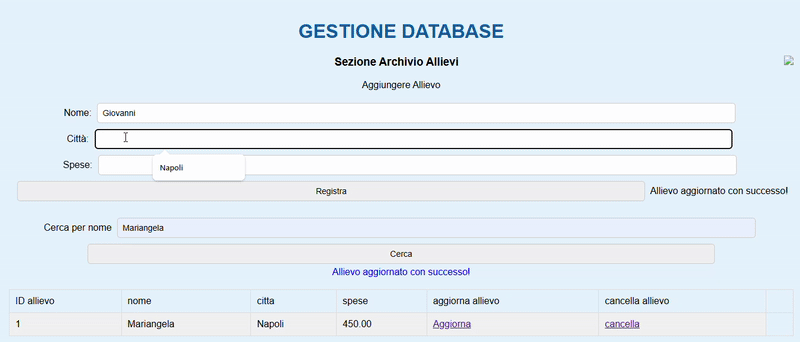

# Gestione Allievi - Applicazione Web 📚

## 📌 Descrizione del Progetto

Benvenuto nel progetto **Gestione Allievi**, una semplice applicazione web sviluppata con **Java JSP**, **Apache Tomcat**, **MySQL** e **CSS** per la gestione di un registro scolastico.

Attraverso l’interfaccia web, è possibile visualizzare, aggiungere e gestire gli studenti registrati nel sistema.

---

## 🖼️ Anteprima

 

---


## 🚀 Funzionalità Principali

- 📋 **Visualizza Allievi**: Elenco completo degli allievi presenti nel database.
- ➕ **Aggiungi Allievo**: Form JSP per inserire nuovi studenti nel sistema.
- 🗃️ **Gestione Database**: Collegamento a MySQL per salvare e recuperare i dati.
- 🎨 **Interfaccia CSS**: Design semplice e chiaro per una buona esperienza utente.

---

## 🛠 Tecnologie Utilizzate

- **Java**: Linguaggio principale del back-end.
- **JSP**: Generazione dinamica di pagine HTML lato server.
- **Apache Tomcat**: Web server per il deployment dell'applicazione.
- **MySQL**: Database relazionale.
- **HTML/CSS**: Interfaccia utente e struttura visiva.

---

## 🎯 Come Avviare il Progetto

### 1. Clona il repository

```bash
git clone https://github.com/tuo-username/gestione-allievi.git
cd gestione-allievi
2. Configura il Database MySQL
Crea il database scuola2:


CREATE DATABASE scuola2;
Importa la struttura dal dump SQL (se presente):


mysql -u root -p scuola2 < database/scuola2.sql
⚠️ Assicurati che il nome del DB corrisponda a quello nel tuo file .jsp

3. Configura Tomcat
Apri il progetto in un IDE (NetBeans, Eclipse o VS Code con estensione JSP).

Associa il server Apache Tomcat.

Deploya il progetto nel server.

4. Avvia l’Applicazione
Avvia Tomcat.

Apri il browser su:


http://localhost:8080/nome-del-progetto/
📊 Struttura del Database (esempio)
Campo	Tipo
id	INT (PK)
nome	VARCHAR(50)
cognome	VARCHAR(50)
classe	VARCHAR(10)
eta	INT

🤝 Contribuire
Vuoi contribuire? Segui questi step:

Fai il fork del progetto

Crea un branch:
git checkout -b feature/nuova-funzionalita

Aggiungi le modifiche
git commit -m "Aggiunta nuova funzionalità"

Pusha la branch
git push origin feature/nuova-funzionalita

Crea una Pull Request ✨

📜 Licenza
Questo progetto è rilasciato sotto la licenza MIT.


📌 Note
L'app è ottimizzata per ambienti di test locali.

Assicurati che il database scuola2 esista, altrimenti verrà mostrato l'errore HTTP 500.

Se usi NetBeans, non caricare nbproject/private su GitHub.

🧾 Autore
[Probyte5D] – 2025
